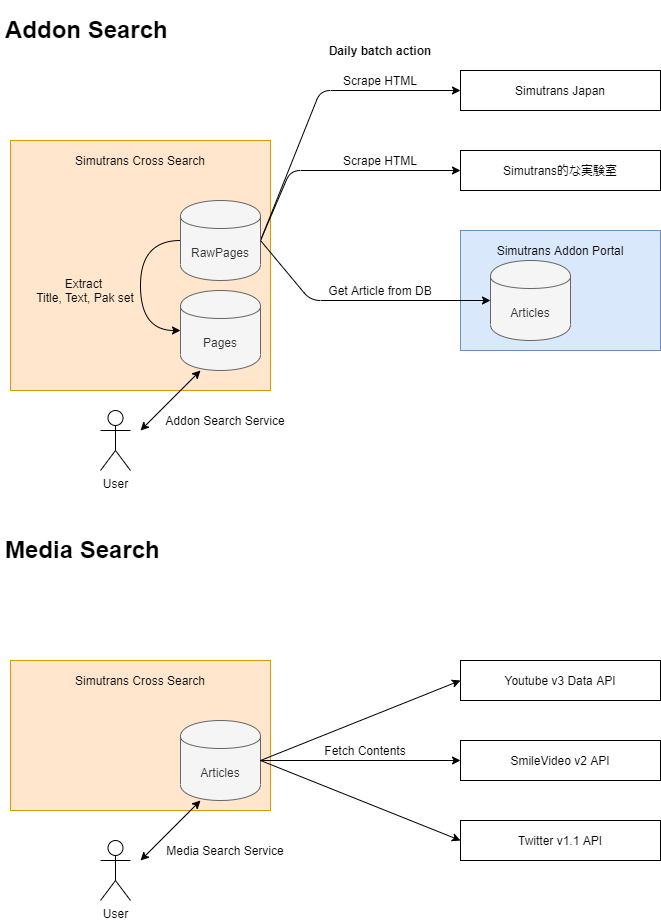

# Simutrans Cross Search
https://cross-search.128-bit.net/

## 仕組み


## 提供機能
- アドオン掲載媒体の更新一覧、テキスト検索画面
    - https://cross-search.128-bit.net/

- アドオン掲載媒体のテキスト検索API
    - https://cross-search.128-bit.net/api/v1/search

- 動画、画像の新着一覧
    - https://cross-search.128-bit.net/articles

## API仕様
IPあたり60回/分の制限があります。
指定可能な検索条件、返却データは画面からの検索と同一です。
https://cross-search.128-bit.net/api/v1/search?word=xxx&paks[]=paksize

### パラメーター一覧
|パラメーター|デフォルト|指定可能な値|説明|
|---|---|---|---|
|word|なし|100文字以内|検索文字列。半角スペースで区切って複数キーワード検索が可能です|
|type|and|and, or|複数キーワード指定時の結合条件|
|paks[]|全て|64, 128, 128-japan|検索対象とするpakセット名。複数指定可能|

### 例
JRまたは国鉄を含むpak128, pak128japan

`https://cross-search.128-bit.net/api/v1/search?word=JR 国鉄&type=or&paks[]=128&paks[]=128-japan`

URLエンコード時

`https://cross-search.128-bit.net/api/v1/search?word=JR+%E5%9B%BD%E9%89%84&type=or&paks%5B%5D=128&paks%5B%5D=128-japan`

### レスポンスボディ
一覧は50件ごとに分かれており50件目以降の記事は data.links.next のURLから取得できます。
```
{
  "data": [
    {
      "site": string 掲載サイト名,
      "title": string ページタイトル,
      "url": string ページURL,
      "paks": [
          string pakセットサイズ名,
          ...
      ],
      "updated_at": string 記事更新日時
    },
    ...
  ],
  "links": {
    "first": string 一覧最初ページのURL,
    "last": string 一覧最終ページのURL,
    "prev": string 一覧一つ前ページのURL,
    "next": string 一覧一つ次ページのURL
  },
  "meta": {
    "current_page": int 現在のページ番号,
    "last_page": int 最後のページ番号,
    "per_page": int 1ページ当たりの記事数,
    "from": int 返却した一覧の最初の記事番号,
    "to": int 返却した一覧の最後の記事番号,
    "total": int 記事の総数
    "path": string リクエストしたAPI URL,
  }
}
```
